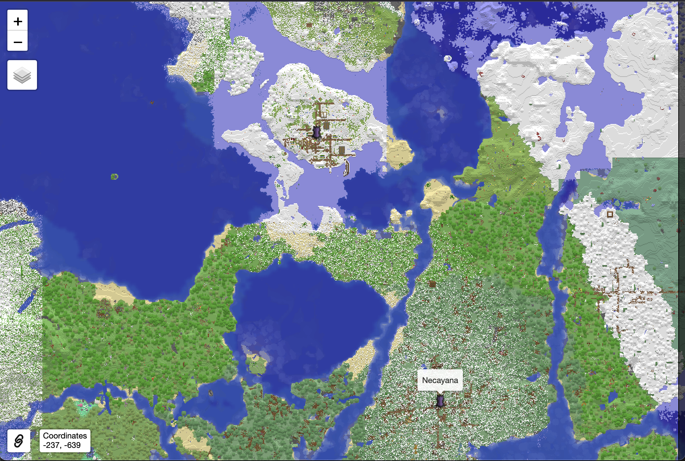

# SquaremapWaystones

A simple mod that adds support for [Wraith Waystones](https://modrinth.com/mod/fwaystones) to [Squaremap](https://modrinth.com/plugin/squaremap).
Currently supports Wraith Waystones [3.1.3+mc1.20](https://modrinth.com/mod/fwaystones/version/3.1.3+mc1.20) and Squaremap [1.2.0](https://modrinth.com/plugin/squaremap/version/AS12cZm5) on Minecraft 1.20.1.

The map [icon](./src/main/resources/fabric_waystones_icon.png) is a modified version of the waystone icon from [FabricWaystones](https://github.com/LordDeatHunter/FabricWaystones/blob/master/src/main/resources/assets/fwaystones/images/fabric_waystones_icon.png).
